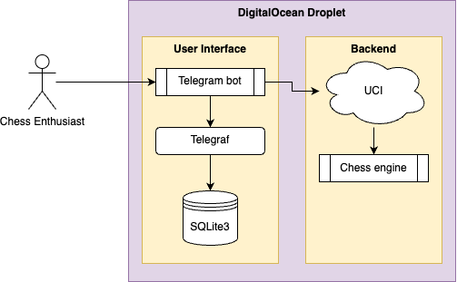
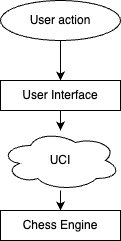

# Minerva Chess Bot

User Interface for Minerva Chess engine.

## User guide

Add the bot to a channel or private message the bot on Telegram. The telegram handle is [@MinervaChessBot](https://t.me/MinervaChessBot).

Start a game with `/start`.

Make moves against the bot using `/move <AN>`.

Note that you can only have one active game at a time.

Coming back to a game? Use `/me` to find the board state of your current game.

### Commands

[@MinervaChessBot](https://t.me/MinervaChessBot) currently supports the following commands:

1. `/start` - start a new game (only one active game per user)
2. `/ping` - test if the bot is online
3. `/me` - retrieve your current active game (if any)
4. `/move <AN>` - make a move in your active game (see below for more details on Algebraic Notation)
5. `/help` - generate help text

### Algebraic Notation (AN)

[@MinervaChessBot](https://t.me/MinervaChessBot) only recognizes valid chess moves using the [Algebraic Notation.](https://en.wikipedia.org/wiki/Algebraic_notation_(chess))

A quick reference for the notation [can be found here.](https://cheatography.com/davechild/cheat-sheets/chess-algebraic-notation/)

## Tech stack

- Telegraf (Telegram API library)
- Typescript
- SQLite3
- Node.js

## Deployment

We have deployed [@MinervaChessBot](https://t.me/MinervaChessBot) onto DigitalOcean for persistence. The steps we took to deploy to DigitalOcean applies to local deployments.

1. Clone the repository

    ```bash
    git clone https://github.com/caaando/Minerva_Chess.git
    cd Minerva_Chess/
    ```

2. Install all Node.js dependencies

    ```bash
    yarn install
    ```

3. [Create a new bot token](https://core.telegram.org/bots/tutorial#obtain-your-bot-token)
4. Inside the project folder, rename `.env.example` to `.env` and provide the obtained token to the `TELEGRAM_BOT_TOKEN` environment variable
5. Run database migrations

    ```bash
    yarn migrate
    ```

6. Run the bot

    ```bash
    yarn bot
    ```

## Engineering Notes

- Pre-commit hooks have been setup using Husky to automatically format staged files to ensure consistent formatting across teammate commits

### System architecture

Minerva Chess uses the following system architecture:



It relies on the Universal Chess Interface to act as a bridge between the Telegram bot and the backend chess engine.
This makes it very easy to change the underlying chess engine while maintaining the same behavior on the Telegram bot.


